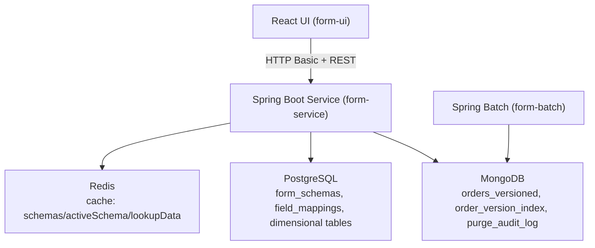

# Dynamic Form System: Developer Guide

**Audit date:** February 11, 2026  
**Repository root:** `/Users/deepaganesh/Projects/dynamic-form-system`

## 1) What This Document Is
This is a practical audit of the **current codebase** and existing documents (`README.md`, `docs/REQUIREMENTS.md`, `docs/DATA MODEL DESIGN.md`, `docs/ARCHITECTURE DIAGRAM.md`) so you can explain the project confidently in interviews even with partial prior context.

It covers:
- What is implemented now (backend, batch, UI)
- What is partially implemented or different from documents
- Which APIs are used by UI
- What to demo end-to-end
- What gaps/risks to mention proactively

---

## 2) Executive Summary
The project is a working multi-module Java + React system for dynamic, schema-driven form versioning.

**Current status (verified):**
- `mvn clean test` -> **PASS**
- `mvn clean install` -> **PASS**
- `npm run build` in `form-ui` -> **PASS**

**Core capabilities present:**
- Immutable order version creation in MongoDB
- Schema version management in PostgreSQL
- Dynamic form rendering from active schema in React
- WIP and COMMITTED workflow
- Version timeline, diff view, and WIP promotion
- All-orders list and draft resume flow
- Field mapping CRUD + prefill from dimensional tables
- Batch purge job for old WIP versions
- Basic auth and role-based restrictions (USER/ADMIN)

---

## 3) Architecture (As Implemented)


---

## 4) Module-by-Module Audit

## 4.1 `form-common`
Implemented and aligned with shared-contract usage:
- DTOs for orders, schemas, mappings, errors
- Enums (`OrderStatus`, `FieldType`)
- Custom exceptions used by global handler

Notable behavior choice:
- `CreateOrderRequest` intentionally has minimal Bean Validation. Final validation is enforced in service layer for COMMITTED saves, enabling flexible draft saves.

## 4.2 `form-service`
### Entities and Repositories
Implemented:
- Mongo entities: `OrderVersionedDocument`, `OrderVersionIndex`, `PurgeAuditLog`
- PostgreSQL entities: `FormSchemaEntity`, `FieldMappingEntity` (JSONB via Hypersistence)
- Repository interfaces for Mongo + JPA with custom queries/aggregations

### Services
Implemented:
- `VersionOrchestrationService`
  - Creates immutable versions
  - Supports draft-friendly orderId generation when needed
  - Enforces strict rules on final submit
  - Provides history, latest, committed, all-orders summary, WIP promotion
- `ValidationService`
  - Schema-driven validation including nested subforms/tables
- `SchemaManagementService`
  - Create/activate/deprecate/get schema with caching
- `DataTransformationService`
  - Uses field mappings to transform SQL source row -> JSON payload
  - Added safer SQL identifier validation and useful error mapping
- `FieldMappingManagementService`
  - CRUD + uniqueness checks for prefill mappings

### Controllers
Implemented:
- `OrderController`
  - Full order lifecycle + prefill + prefill mapping options endpoint
- `SchemaController`
  - Schema lifecycle + field mapping CRUD (admin-restricted)
- `GlobalExceptionHandler`
  - Consistent error payloads and status codes

### Security and Config
Implemented:
- Spring Security 6 style `SecurityFilterChain`
- In-memory users for demo (`user/password`, `admin/admin`, `admin@example.com/demo123`)
- Role checks in URL rules + `@PreAuthorize`
- Redis cache manager config + TTLs
- OpenAPI config, CORS, JPA/Mongo auditing, Web JSON config

## 4.3 `form-batch`
Implemented:
- `PurgeTasklet` with per-order WIP cleanup algorithm
- Scheduled runner (`0 0 0 * * ?`)
- Purge audit log writes
- Batch metadata via in-memory H2

## 4.4 `form-ui`
Implemented:
- Dark themed dashboard with role toggle (USER/ADMIN)
- Pages/components:
  - `OrderForm` (schema-driven rendering, inline validation, draft save, submit)
  - `OrdersList` (global all-orders list + resume draft)
  - `VersionHistory` (timeline, diff, promote WIP, export JSON)
  - `SchemaManager` (catalog + inspector + schema modal + mapping modal)
- Axios service layer for all backend endpoints
- Prefill assistant moved to separate collapsible panel
- Draft auto-save now event-based (tab hide/page close), plus explicit "Save as Draft"
- Resume draft flow via URL params (`resumeOrderId`, optional `resumeVersion`)

---

## 5) API Coverage: Backend vs UI

| Backend Endpoint | Role | Used in UI | Component |
|---|---|---|---|
| `GET /v1/orders` | USER | Yes | `OrdersList` |
| `POST /v1/orders` | USER | Yes | `OrderForm` |
| `GET /v1/orders/{orderId}` | USER | Yes | `VersionHistory` |
| `GET /v1/orders/{orderId}/versions` | USER | Yes | `VersionHistory`, draft resume logic |
| `GET /v1/orders/{orderId}/versions/{version}` | USER | Yes | `VersionHistory`, `OrderForm` resume |
| `POST /v1/orders/{orderId}/versions/{version}/promote` | USER | Yes | `VersionHistory` |
| `GET /v1/orders/{orderId}/committed-versions` | USER | Yes | `VersionHistory` |
| `GET /v1/orders/prefill` | USER | Yes | `OrderForm` prefill panel |
| `GET /v1/orders/prefill/mappings` | USER | Yes | `OrderForm` prefill assistant |
| `GET /v1/schemas/active` | USER | Yes | `OrderForm`, `SchemaManager` |
| `GET /v1/schemas/{id}` | USER | Yes | `VersionHistory`, `SchemaManager` |
| `GET /v1/schemas` | ADMIN | Yes | `SchemaManager` |
| `POST /v1/schemas` | ADMIN | Yes | `SchemaManager` |
| `PUT /v1/schemas/{id}/activate` | ADMIN | Yes | `SchemaManager` |
| `DELETE /v1/schemas/{id}` | ADMIN | Yes | `SchemaManager` |
| `GET /v1/schemas/{id}/mappings` | ADMIN | Yes | `SchemaManager` |
| `POST /v1/schemas/{id}/mappings` | ADMIN | Yes | `SchemaManager` |
| `PUT /v1/schemas/{id}/mappings/{mappingId}` | ADMIN | Yes | `SchemaManager` |
| `DELETE /v1/schemas/{id}/mappings/{mappingId}` | ADMIN | Yes | `SchemaManager` |

Conclusion: UI is wired to all current feature APIs.

---

## 6) Requirement Traceability (From `docs/REQUIREMENTS.md`)

| Requirement | Status | Notes |
|---|---|---|
| FR-1 multi-valued fields | Implemented | UI renderer supports `multivalue`; backend validates min/max values |
| FR-2 nested subforms | Implemented | UI + backend recursive validation supports `subform` |
| FR-3 inline tables | Implemented | UI table rows + backend recursive row validation |
| FR-4 standard fields | Implemented | Text/number/date/dropdown/checkbox/calculated support in UI |
| FR-5 JSON model with version metadata | Implemented | Stored in Mongo documents + index collection |
| FR-6 composite uniqueness | Implemented | Mongo compound unique index on `(orderId, orderVersionNumber)` |
| FR-7 immutable insert-only model | Implemented (with caveat) | New versions are insert-only; previous records are not mutated now |
| FR-8 auto-versioning | Implemented | Every save creates new version; UI auto-save now event-based (not timer loop) |
| FR-9 schema versioning | Implemented | `form_schemas` + activate/deprecate workflow |
| FR-10 backward compatibility | Implemented (practical) | History stores `formVersionId`; UI fetches schema by version for display |
| FR-11 schema registry | Implemented | Schema APIs and DB table |
| FR-12 WIP vs committed status | Implemented | Full support in backend + UI |
| FR-13 end-of-day purge | Implemented | Batch tasklet keeps latest WIP only; preserves COMMITTED |
| FR-14 history + compare | Implemented | Timeline + JSON diff in UI |
| FR-15 dimensional prefill integration | Implemented | Field mapping-driven prefill endpoint + UI panel |
| FR-16 denormalized snapshot | Implemented | Payload stored per version in Mongo |

---

## 7) Manager-Requested Additions Audit

| Requested Feature | Status | Where |
|---|---|---|
| Global all-orders list | Implemented | `OrdersList.jsx` + `GET /v1/orders` |
| Promote WIP version action | Implemented | `VersionHistory.jsx` + promote endpoint/service |
| Fully schema-driven runtime form renderer | Implemented | `OrderForm.jsx` dynamic renderer based on active schema |

---

## 8) Important Deviations / Risks to Explain in Interview

1. **`isLatestVersion` flag semantics changed vs early design docs**  
   - Current service derives “latest” by highest version number (`findTopByOrderIdOrderByOrderVersionNumberDesc`) instead of mutating older documents to set `isLatestVersion=false`.  
   - This keeps stricter insert-only behavior but means `isLatestVersion` field is not the source of truth.

2. **Prefill depends on two things not auto-seeded**  
   - Active field mappings for schema (`field_mappings`)  
   - Actual source dimensional table/data in PostgreSQL (e.g., `delivery_companies`)  
   - Without both, prefill returns empty or validation error.

3. **Docs require profile-aware reading**  
   - Runtime authentication is HTTP Basic in demo mode with environment-configurable credentials.
   - Detailed docs are retained in spaced filenames; compatibility aliases are provided for hyphenated links.

4. **No persistent production-grade identity in demo**  
   - In-memory users only; no JWT/OAuth/SSO integration.

5. **UI auto-save model is lifecycle-triggered, not interval polling**  
   - Saves on explicit draft action and on tab-hide/page-close.  
   - Better UX than frequent timer autosave for this demo, but worth calling out.

6. **Test scope is good but not full enterprise breadth yet**  
   - Unit + web-layer integration tests are present and passing.  
   - No full Testcontainers-backed end-to-end integration suite yet despite dependencies.

---

## 9) Runtime Prerequisites (To Avoid Demo Surprises)

You need these running before backend demo:
- MongoDB on `localhost:27017`
- PostgreSQL on `localhost:5432` (`form_schema` DB)
- Redis on `localhost:6379`

Common runtime failures:
- `Port 8080 already in use` -> stop existing process or change server port
- `relation "delivery_companies" does not exist` -> create dimensional table + seed rows
- Prefill returns no data -> mappings exist but no matching source row key

---

## 10) Build/Test Verification (Captured)

Commands executed during this audit:
- `mvn clean test` -> PASS (all modules)
- `mvn clean install` -> PASS (all modules)
- `cd form-ui && npm run build` -> PASS
- `mvn -pl form-service spring-boot:run` may fail if port 8080 is occupied

---

## 11) Suggested Interview Demo Flow (10-15 min)

1. Show architecture quickly (UI -> service -> Mongo/Postgres/Redis + batch purge).
2. Log in as **Admin** in UI role toggle.
3. Open Schema Manager:
   - show active schema
   - create/activate schema (or inspect existing)
   - show field mappings for prefill
4. Open Order Form:
   - dynamic fields rendered from schema
   - prefill from mapping source
   - save draft (WIP)
   - submit final (COMMITTED)
5. Open All Orders:
   - show latest snapshots and counts
   - use Resume Draft action for WIP
6. Open Version History:
   - timeline + selected version details
   - diff vs previous version
   - promote a WIP version to committed
7. Mention batch purge strategy and audit log model.

---

## 12) Short Interview Talking Points (Ready-to-Use)

- “We separated mutable schema metadata (Postgres) from immutable transactional snapshots (Mongo) to simplify schema evolution.”
- “Every save creates a new order version, so auditability is inherent rather than retrofitted.”
- “For demo usability, UI enforces inline schema-driven validation and supports partial draft capture; stricter checks happen on final submit.”
- “Prefill is mapping-driven so we can onboard new dimensional sources without changing application code.”
- “Role controls are enforced both server-side and mirrored in UI by disabling admin-only actions for USER role.”

---

## 13) If Asked “What Would You Improve Next?”

1. Add Testcontainers integration tests for full Mongo + Postgres workflows.
2. Add Flyway auto-migration config and seed scripts for dimensional demo data.
3. Move from in-memory basic auth to JWT/OAuth2 with refresh tokens.
4. Add optimistic concurrency controls for high-contention orders.
5. Add centralized observability: structured logs + tracing + dashboards.

---

## 14) Quick Commands

```bash
# Build and test all modules
mvn clean install

# Run service only
mvn -pl form-service spring-boot:run

# Run batch only
mvn -pl form-batch spring-boot:run

# Run UI
cd form-ui
npm install
npm run dev
```
